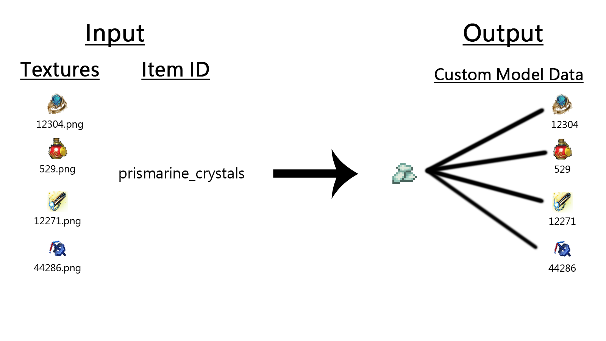

# mc-resource-pack-creator

A simple Minecraft resource pack creator in Python

I use this to create different custom models for item(s), it's fast.

## Why in Python?

Bruh cause it's simple and faster to develop

## What does it do?

It creates model data files (Custom model data) from given images.

I tried my best to draw a picture for better explanation over just words...

## Configuration

* You can change the **output resource pack name** and **item id** in [config.py](./config.py)

* You may want to change the values in the output `.json` files for different item sizes

## FAQ

### Does it overwrites the original data?

No it doesn't, it appends to the `.json` files if the target custom model data doesn't exist already.

But it skips it if the target custom model data json file already exists.

### Any examples for the json files in the resource pack?

Yes, see [template](./template)

I'm actually planning on adding more examples

## Planned

* [ ] Store default json in a single `.py` file
* [ ] Add more examples in [template](./template)
